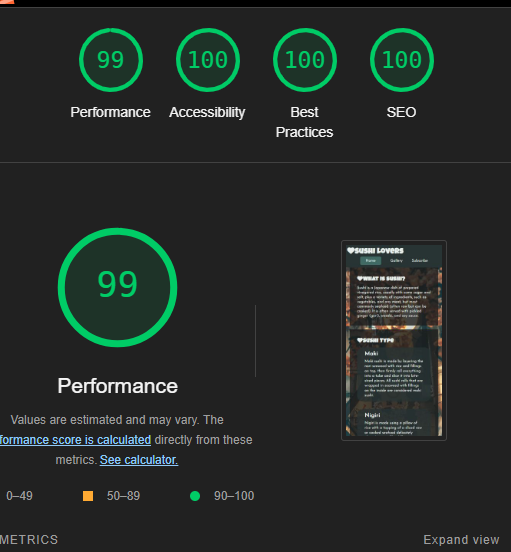

# Sushi lovers

[Link for the live project](https://sabri-bel.github.io/PP1/index.html)

## Overview 
This website was created for provide more information about sushi, it is designed for people who loves sushi and want to know a bit more.
As a first time users, it can be useful for someone how can learn more about the different type of sushi, and subscribe to a little community of sushi lovers. 
Is it also possible to visit the website again and check new images from other users.
About the newsletter, user can decide to subscribe for one or more interests or access to the official social pages directly from the footer links.

## Features
### 1. Features available in each page:

- __Navigation Bar__ that allow the user to navigate between the contents easily

- __Footer__ that contain links to redirect the user to the official page for the main social networks 

### 2. Specific Features

- __Home Page__ that provide useful information about sushi

- __Gallery Section__ contain beautiful photos and can also be implemented with users images as well

- __Subscribe Section__ it can be used for register the user to a newsletter. customer can decide to opt in to one or to all the subsection proposed.

### Features to be implemented in the Future
- Recipes page
- Video tutorial

## Design
The design of the website use a mix of relevant images, green and orange background color 
It can adapt to the size of the screen in use for styling purposes.

## Tecnology Used

### Languages
- HTML5
- CSS3

### Libraries 
- Google Fonts
- Font Awesome

### Programs
- GitPod
- GitHub
- Cloudconvert for resizing the gallery Images https://cloudconvert.com/

## Testing

### Browser Compatibility
- Tested the website using the following browser: Chrome, Firefox, Edge.
- Tested for the accessibility requirement in Lighthouse, no issue found.

- Verified the responsivity of the screen in different screen size.
- Verified the "subscribe" form functionality.
- Verified the responsivity of the link in the footer for the social networks.

### Validator Testing
* HTML 
No errors were returned when passing through the official W3C validator

+

* CSS 
No errors were returned when passing through the official validator

### Test Case 

## Deployment

This website was deployed to GitHub pages. 
The steps to deploy are the following: 
- I the left side of the Dashboard, locate the Sabri-bel/PP1 repository
- In the repository, click the Settings tab 
- From the left selection menu, select Pages
- Make sure that "main" branch has been selected.
- Return to the "code" Repository tab and select "deployments"
- From the list, select the deployment.

## How to clone the repository
- Go to the https://sabri-bel.github.io/PP1/ repository on GitHub
- Click the "Code" button to the right of the screen, click HTTPs and copy the link there
- Open a GitBash terminal and navigate to the directory where you want to locate the clone
- On the command line, type "git clone" then paste in the copied url and press the Enter key to begin the clone process

## Credits
### Content
Some of the information for the homepage was taken from webstaurantstore.com and Wikipedia

### Media and images
- The images used for the backgroud were downloaded from Unsplash
- All the images used for the gallery page were downloaded from Unsplash and reszed with CloudConvert
- The icons in the footer and in the headers are from Font Awesome
- The fonts used are imported from Google Fonts

